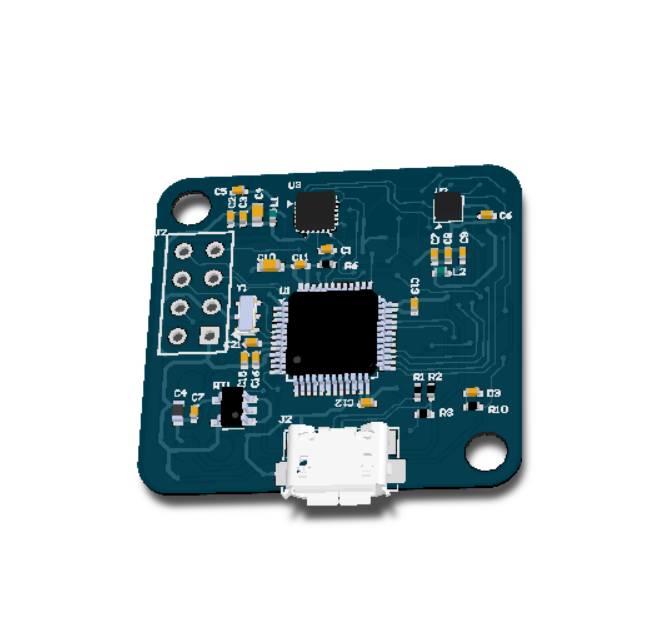

# GeekIMU
GeeKIMU 是一个非常精致小巧的imu模块，采用Oculus相同的陀螺仪和磁力计。其中陀螺仪采用MPU6500，而磁力计则采用LIS3MDL。传感器的数据输出采用USB-HID协议。由于MPU6500和LIS3MDL都支持磁力计，所以可以在极短的时间内完成IMU数据的采样。本项目旨在为对IMU感兴趣的人提供一些帮助，减少重复写驱动的麻烦。

硬件功能描述：1、三轴加速度计、陀螺仪、磁力计

软件功能：

1. windows USB-HID 1000Hz 驱动，采用Visual Studio编译，获取原始IMU的数据
2. 采用C# + OpenGL 实现3D图形界面校准磁力计并写入参数到STM32
3. 软件GUI发送命令设置陀螺仪静止校准
4. 3D姿态显示

其他用途：

1. ROS系统IMU数据源
2. AHRS算法仿真调试，如EFK算法零偏估计
3. Oculus VR & SteamVR

### 规格
陀螺仪   ：MPU6500
磁力计   ：LIS3MDL
通信方式：USB-HID
解算频率：最高1000Hz

